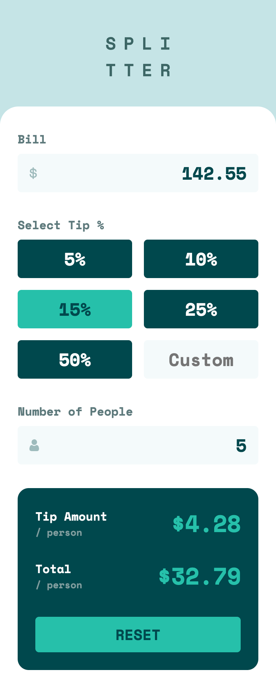
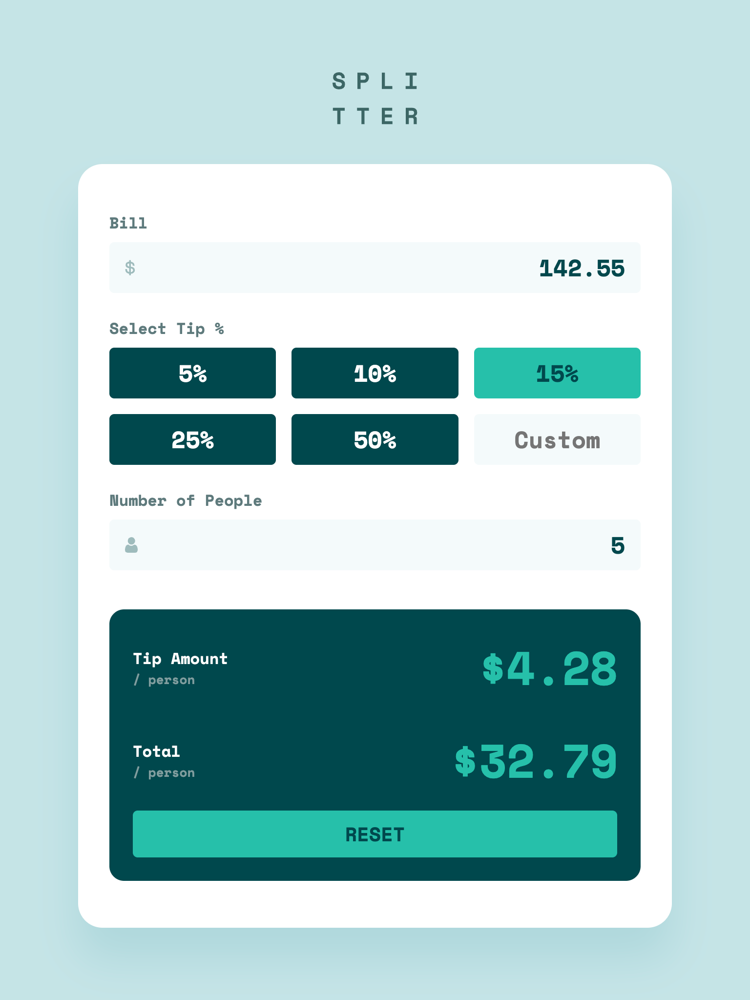
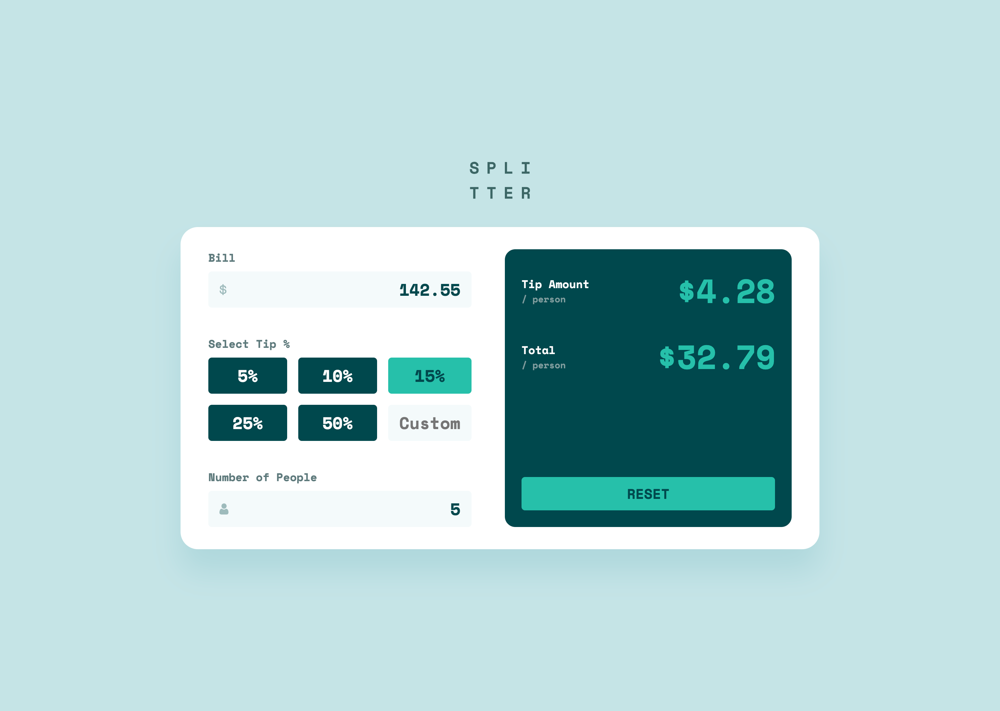

# Frontend Mentor - Entertainment web app solution

This is a solution to the [Tip calculator app challenge on Frontend Mentor](https://www.frontendmentor.io/challenges/tip-calculator-app-ugJNGbJUX). Frontend Mentor challenges help you improve your coding skills by building realistic projects.

I've [completed the challenge before](https://www.frontendmentor.io/solutions/tip-calculator-app-using-client-side-validation-9pA0gDdcOs), but am approaching it this second time as part of the [Introduction to front-end testing](https://www.frontendmentor.io/learning-paths/introduction-to-front-end-testing-kacF_IJQO5) Frontend Mentor learning path. This continues my efforts to learn my chosen JS Framework - [Vue.js](https://vuejs.org/) + [Pinia](https://pinia.vuejs.org/). And now my goal was to learn to incorporate unit testing.

## Table of contents

- [Overview](#overview)
  - [The challenge](#the-challenge)
  - [Screenshots](#screenshots)
  - [Links](#links)
- [My process](#my-process)
  - [Built with](#built-with)
  - [What I learned](#what-i-learned)
  - [Continued development](#continued-development)
  - [Useful resources](#useful-resources)
- [Author](#author)

## Overview

### The challenge

Users should be able to:

- View the optimal layout for the app depending on their device's screen size
- See hover states for all interactive elements on the page
- Calculate the correct tip and total cost of the bill per person

### Screenshots

|             Mobile designed at 375px:              |             Tablet designed at 1440px:             | Desktop designed at 1440px:                         |
| :------------------------------------------------: | :------------------------------------------------: | --------------------------------------------------- |
|  |  |  |

### Links

- Solution URL: [https://github.com/elisilk/tip-calculator-app-v2](https://github.com/elisilk/tip-calculator-app-v2)
- Live Site URL: [https://elisilk.github.io/tip-calculator-app-v2/](https://elisilk.github.io/tip-calculator-app-v2/)

## My process

### Built with

- Semantic HTML5 markup
- CSS custom properties
- Flexbox
- CSS Grid
- Mobile-first workflow
- Accessibility
- [Vite](https://vite.dev/)
- [Vue](https://vuejs.org/)
- [Pinia](https://pinia.vuejs.org/)
- [Vitest](https://vitest.dev/guide/)
- [Vue Test Utils](https://test-utils.vuejs.org/guide/)

### What I learned

As always, so many cool :sunglasses: things. Here are some of the key resources I used.

#### Testing the App

- Vue Testing Guides
  - [Guide to Unit Testing Vue Components (part 1)](https://testdriven.io/blog/vue-unit-testing/) + [Testing Pinia Data Stores in Vue (part 2)](https://testdriven.io/blog/vue-pinia-testing/)
    - [Vue Weather App repository](https://gitlab.com/patkennedy79/vue-weather-app) + [Live App](https://snazzy-taffy-cd99f4.netlify.app/)
  - [Vue - Testing](https://vuejs.org/guide/scaling-up/testing.html)
  - [Pinia - Testing stores](https://pinia.vuejs.org/cookbook/testing.html)
  - [A guide to Vitest automated testing with Vue components](https://blog.logrocket.com/guide-vitest-automated-testing-vue-components/)
  - [Getting Started with Vitest for Vue.js and Vite Testing](https://vueschool.io/articles/vuejs-tutorials/start-testing-with-vitest-beginners-guide/)
- [Testing Library](https://testing-library.com/)
  - [Testing Library > Docs](https://testing-library.com/docs/)
  - [Vue Testing Library > Cheatsheet](https://testing-library.com/docs/vue-testing-library/cheatsheet/)
  - [Testing Library > User Interactions](https://testing-library.com/docs/user-event/intro)
- Testing with [Vitest](https://vitest.dev/guide/)
  - [Test API Reference](https://vitest.dev/api/)
  - [`expect`](https://vitest.dev/api/expect)
  - [Vitest cheat sheet](https://github.com/sapegin/vitest-cheat-sheet)
  - [Vitest > Comparisons with Other Test Runners](https://vitest.dev/guide/comparisons.html)
- Other Testing Frameworks/Utilities
  - [Jest](https://jestjs.io/)
    - [Jest > Docs > Getting Started](https://jestjs.io/docs/getting-started)
    - [Jest cheatsheet](https://devhints.io/jest)
- General Testing Resources (not specifically for Vue)
  - [Static vs Unit vs Integration vs E2E Testing for Frontend Apps](https://kentcdodds.com/blog/static-vs-unit-vs-integration-vs-e2e-tests)
  - [How to know what to test](https://kentcdodds.com/blog/how-to-know-what-to-test)
  - [React Testing Library – Tutorial with JavaScript Code Examples](https://www.freecodecamp.org/news/react-testing-library-tutorial-javascript-example-code/)

#### Building the App

- Form Validation
  - [Vue > Event Handling](https://vuejs.org/guide/essentials/event-handling)
  - [Web forms](https://developer.mozilla.org/en-US/docs/Learn_web_development/Extensions/Forms)
  - [`<form>`: The Form element](https://developer.mozilla.org/en-US/docs/Web/HTML/Reference/Elements/form)
  - [`<input>`: The HTML Input element](https://developer.mozilla.org/en-US/docs/Web/HTML/Reference/Elements/input)
    - [`<input type="number">`](https://developer.mozilla.org/en-US/docs/Web/HTML/Reference/Elements/input/number)
    - [`<input type="radio">`](https://developer.mozilla.org/en-US/docs/Web/HTML/Reference/Elements/input/radio)
  - [`<output>`: The Output element](https://developer.mozilla.org/en-US/docs/Web/HTML/Reference/Elements/output)
    - [The output HTML element is an aria-live region](https://www.stefanjudis.com/today-i-learned/the-output-html-element-is-an-aria-live-region/)
  - [`<button>`: The Button element](https://developer.mozilla.org/en-US/docs/Web/HTML/Reference/Elements/button)
  - [Form Validation: You want `:not(:focus):not(:placeholder-shown):invalid`, not `:invalid`](https://www.bram.us/2021/01/28/form-validation-you-want-notfocusinvalid-not-invalid/)
  - [How to target non-empty but invalid input elements with CSS](https://www.stefanjudis.com/notes/target-non-empty-but-invalid-input-element-with-css/)

### Continued development

Specific areas that the solution should be improved (known issues):

- [x] Fix the block end spacing below the app logo in the desktop view
- [ ] Fix the inline padding of the main section in the tablet view
- [ ] Do some additional input validation/error checking.
- [ ] Fix issue where the options tip percentage and the custom tip percentage errors should be coordinated (so that if one is present, the other should be cleared, and vice versa)
  - Relatedly, if the custom tip percentage option is chosen, but no custom value is given, there should be a valueMissing error, but currently there is not.
  - Should that custom input number be required? If so, then if one of the standard options is checked, how do we know to ignore this?
- [x] Fix issue on Safari where user can enter in letters and so that should result in an error that doesn't happen on the Chrome browser (which doesn't even let those characters be entered).
  - Fixed the issue by looking specifically for the [ValidityState: badInput property](https://developer.mozilla.org/en-US/docs/Web/API/ValidityState/badInput) and prioritizing that over the [ValidityState: valueMissing property](https://developer.mozilla.org/en-US/docs/Web/API/ValidityState/valueMissing)
  - [`<input type="number">` > Validation](https://developer.mozilla.org/en-US/docs/Web/HTML/Reference/Elements/input/number#validation)
- [x] Fix issue where the custom tip percentage input was supposed to be cleared when one of the standard tip percentage options was chosen (so as to clear up any confusion), but was not clearing.
  - Used the [Pinia $patch method](https://pinia.vuejs.org/core-concepts/state.html#Mutating-the-state), which seems to do the trick.
- [x] Fix grid positioning of the legend element
  - Seems like there are no great solutions for this known issue, but Adrian Roselli seems to have done the most thinking on it, and so I followed his approach of: Visually hiding the `<legend>` and replicating its content into a node in the `<fieldset>` and then adding `aria-hidden="true"` to that node.
  - [Use Legend and Fieldset](https://adrianroselli.com/2022/07/use-legend-and-fieldset.html)
  - [Fieldsets, Legends and Screen Readers again](https://www.tpgi.com/fieldsets-legends-and-screen-readers-again/)
  - [`display: contents`](https://developer.mozilla.org/en-US/docs/Web/CSS/display#display_contents)
  - [caniuse > CSS display: contents](https://caniuse.com/css-display-contents)
  - [More accessible markup with display: contents](https://hidde.blog/more-accessible-markup-with-display-contents/)
  - [Display: Contents Is Not a CSS Reset](https://adrianroselli.com/2018/05/display-contents-is-not-a-css-reset.html)

Specific enhancements I'd like to make (feature requests):

- [ ] Add a '%' sign in the custom tip percentage input element as the user is typing their value
- [ ] Should the input elements be validating on @input or @blur events?
- [ ] Style the up and down arrows for the input number elements?
  - [Styling an input type=number](https://stackoverflow.com/questions/26024771/styling-an-input-type-number)
- [ ] Use [customError](https://developer.mozilla.org/en-US/docs/Web/API/ValidityState/customError) with [ValidityState](https://developer.mozilla.org/en-US/docs/Web/API/ValidityState) for the specific case when the number of people is 0 (as compared to being less than 0, which would be a simpler [rangeUnderflow](https://developer.mozilla.org/en-US/docs/Web/API/ValidityState/rangeUnderflow) error)

More general ideas I want to consider:

Hmm 🤔 ...

### Useful resources

- [Vue Guide](https://vuejs.org/guide/)
- [Pinia Guide](https://pinia.vuejs.org/core-concepts/)
- [Vite Guide](https://vite.dev/guide/)
- [MDN Web Docs for CSS](https://developer.mozilla.org/en-US/docs/Web/CSS) - Went here a lot to reference the different CSS properties and the shorthands, and all the great explanations about best practices.

## Author

- Website - [Eli Silk](https://github.com/elisilk)
- Frontend Mentor - [@elisilk](https://www.frontendmentor.io/profile/elisilk)
